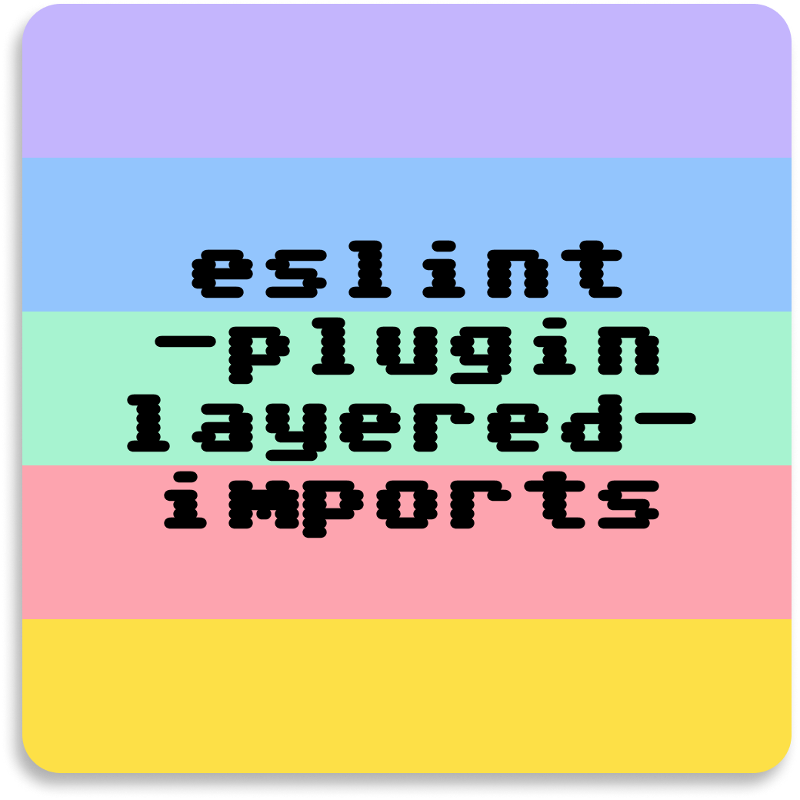

<p align="center">
  
</p>

<h1 align="center" style="border-bottom: none;">
    <code>eslint-plugin-layered-imports</code>
</h1>

<p align="center">
  ESLint plugin for organizing imports into readable groups, useful for FSD and other layered frontend architectures.
</p>

## Why?

Layered frontend architectures help teams manage dependencies, but import sections can quickly become noisy and inconsistent.

This plugin aims to make imports easier to scan by grouping them by source type and enforcing readable spacing between groups.

## Example

```ts
import path from "node:path";

import React from "react";
import { clsx } from "clsx";

import { userApi } from "@/entities/user";
import { Button } from "@/shared/ui";

import styles from "./style.module.css";
import { helper } from "../lib/helper";
```

## Usage

### FSD preset

Use the FSD-friendly preset to enable the plugin with sensible defaults for layered frontend projects.

The preset treats `@/` imports as internal imports, orders top-level groups as `builtin`, `external`, `internal`, `relative`, and orders internal imports by the common FSD layer order: `app`, `pages`, `widgets`, `features`, `entities`, `shared`.

```js
import layeredImports from "eslint-plugin-layered-imports";

export default [layeredImports.configs.fsd];
```

You can override the preset by adding another config object after it.

```js
import layeredImports from "eslint-plugin-layered-imports";

export default [
  layeredImports.configs.fsd,
  {
    rules: {
      "layered-imports/import-spacing": [
        "error",
        {
          internalAliases: ["@/", "~/"],
        },
      ],
    },
  },
];
```

### Manual setup

```js
import layeredImports from "eslint-plugin-layered-imports";

export default [
  {
    plugins: {
      "layered-imports": layeredImports,
    },
    rules: {
      "layered-imports/import-spacing": "error",
    },
  },
];
```

## Rules

### `import-spacing`

Requires a blank line between different import groups.

The initial groups are:

- `builtin`: Node.js built-in modules such as `node:path` or `fs`
- `external`: npm package imports such as `react` or `clsx`
- `internal`: project-local alias imports such as `@/shared/ui`
- `relative`: relative imports such as `./helper` or `../lib/helper`

#### Options

##### `internalAliases`

Type: `string[]`

Default: `["@/"]`

Configures which import source prefixes should be treated as the `internal` group.

```js
export default [
  {
    plugins: {
      "layered-imports": layeredImports,
    },
    rules: {
      "layered-imports/import-spacing": [
        "error",
        {
          internalAliases: ["@/", "~/", "@app/"],
        },
      ],
    },
  },
];
```

Configured aliases are matched as prefixes. Use specific prefixes such as `@/` or `@app/` instead of a broad `@` prefix so scoped packages such as `@tanstack/react-query` remain external.

##### `groups`

Type: `Array<"builtin" | "external" | "internal" | "relative">`

Default: `["builtin", "external", "internal", "relative"]`

Configures the expected order of import groups. The array must include each group exactly once.

```js
export default [
  {
    plugins: {
      "layered-imports": layeredImports,
    },
    rules: {
      "layered-imports/import-spacing": [
        "error",
        {
          groups: ["builtin", "external", "internal", "relative"],
        },
      ],
    },
  },
];
```

Imports are reported when a later group appears before an earlier configured group.

##### `internalLayerOrder`

Type: `string[]`

Default: `undefined`

Configures an optional order inside the `internal` group. The rule removes the matching `internalAliases` prefix, reads the first path segment as the internal layer, and orders known layers by this array.

```js
export default [
  {
    plugins: {
      "layered-imports": layeredImports,
    },
    rules: {
      "layered-imports/import-spacing": [
        "error",
        {
          internalAliases: ["@/"],
          internalLayerOrder: [
            "app",
            "pages",
            "widgets",
            "features",
            "entities",
            "shared",
          ],
        },
      ],
    },
  },
];
```

For example, `@/shared/ui/button` is treated as the `shared` layer. Known layers are ordered before unknown internal paths. Unknown internal paths keep their existing relative order. Imports in the same known layer are sorted by source path.

#### Autofix behavior

The rule can autofix safe import group order violations. When imports are in the same contiguous import block, `--fix` reorders them by the configured `groups` order and normalizes blank lines between groups.

```ts
import helper from "./helper";
import React from "react";
```

is fixed to:

```ts
import React from "react";

import helper from "./helper";
```

Autofix is intentionally conservative:

- It does not move imports across non-import statements.
- It does not reorder an import block that contains side-effect imports such as `import "./setup";`.
- Leading comments attached to an import move together with that import.
- Imports inside the same group keep their existing relative order unless `internalLayerOrder` is configured for internal imports.

## Roadmap

- [x] Add `import-spacing` rule
- [x] Support configurable import group order
- [x] Add auto-fix support
- [x] Add FSD-friendly preset
- [x] Support optional internal layer ordering
